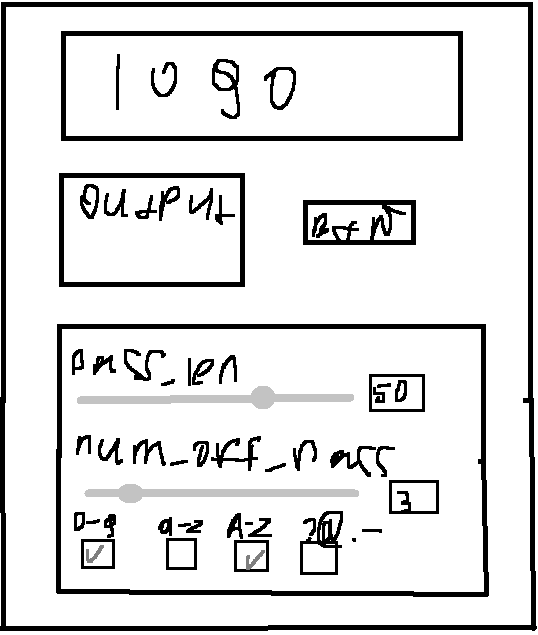
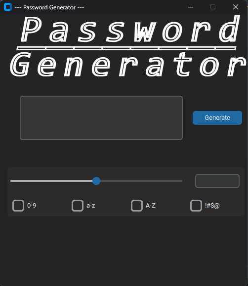
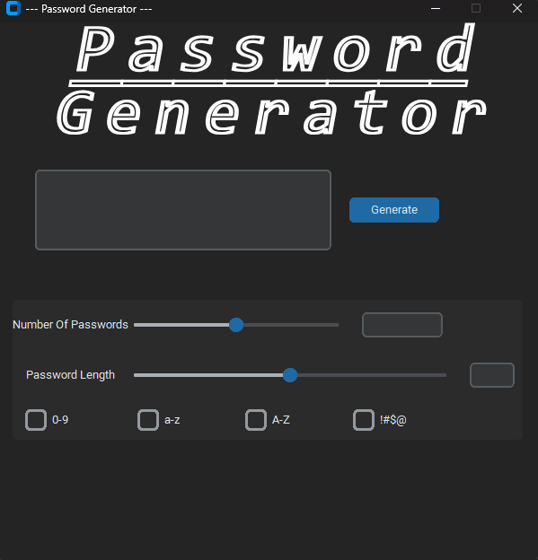
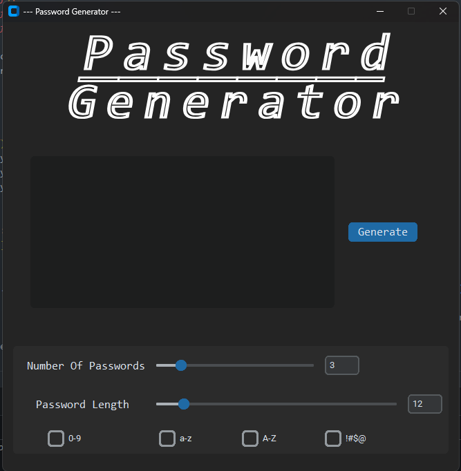
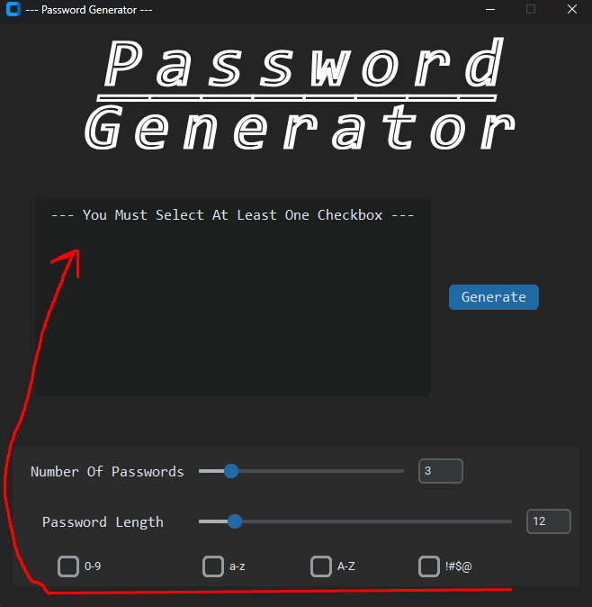
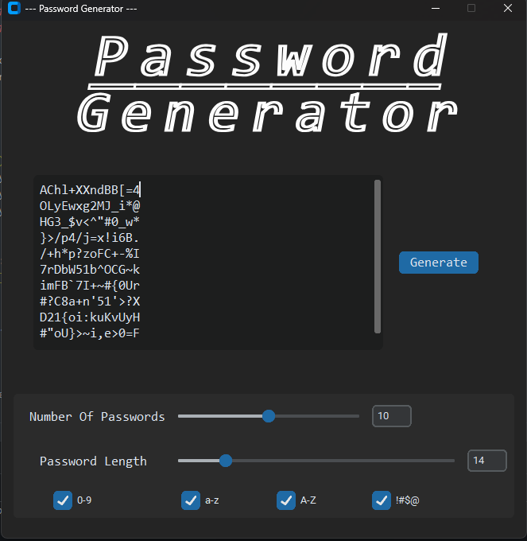

<H1 id="up" align="center" > Password Generator</H1>

  
Table of Contents

  <ol >
    <li >
      <a href="#info">About The Project</a>
      <ul>
        <li><a href="#build_with">Build With</a></li>
      </ul>
    </li>
    <li>
      <a href="#illustration">Illustration</a>
      <ul>
        <li><a href="#fv">First Version</a></li>
        <li><a href="#sv">Second Version</a></li>
        <li><a href="#final">Final Version</a></li>
      </ul>
    </li>
    <li><a href="#install">Download</a></li>
    
  </ol>

<H2 id="info"> General Info </H2>
Finally I tried to separate the logic and tried to use OOP, stupid but still OOP

I've also more or less figured out sane commits and pushes.

To tell you the truth, I did this project with the idea that I could use it as a college project of some kind.

And I want to say that it turned out better than I expected.

<H3 id="build_with"> Build Interface With: </H3>

* <a href="https://customtkinter.tomschimansky.com/">CustomTkinter </a>
* <a href="https://pyinstaller.org/en/stable/">PyInstaller</a>
* <a href="https://jrsoftware.org/isinfo.php">InnoSetup</a>

<H2 id="illustration"> Illustration </H2>

<H3> Demo </H3>

* It's a template created in paint

 

<H3 id="fv"> First Version </H3>

Just a skeleton interface

<H3 id="sv"> Second Version </H3>

Interface a little bit changed

* Added explanations
* Added second slider

<H3 id="final"> Final version </H3>

>In fact, there are 2 more before this version, but there the changes mostly touched on the logic

* CheckBox Checking
* Default value for sliders
* TextBox that can hold 10 passwords (Next you need to scroll down)

<H3 id="install"> Download </H3>

If You want You can download it (From DropBox):

> ***06.09.23 Link not checked on other pc's***
> 

<a href="https://www.dropbox.com/sh/h1dft6eb7fmf7lg/AAB4-uVJa-VuchxmxI2E2ru8a?dl=0">Password Generator</a>

